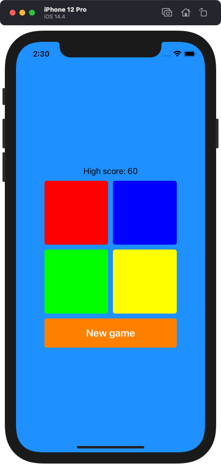
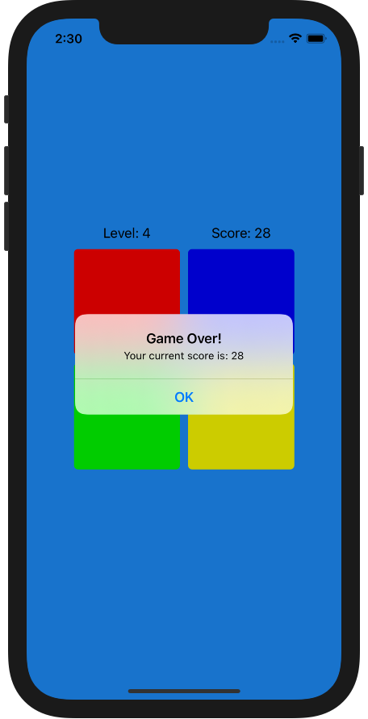

## Simon Says

  
  

### Requirements:

- The game must have 4 buttons, each of a different color of your choice.

- The game begins when the player hits taps a start button.

- When the game ends, it should display "Game Over!" and ask the player to try again.

- Display the "high scores" for a particular gaming session (they do not need to persist after closing the browser).
